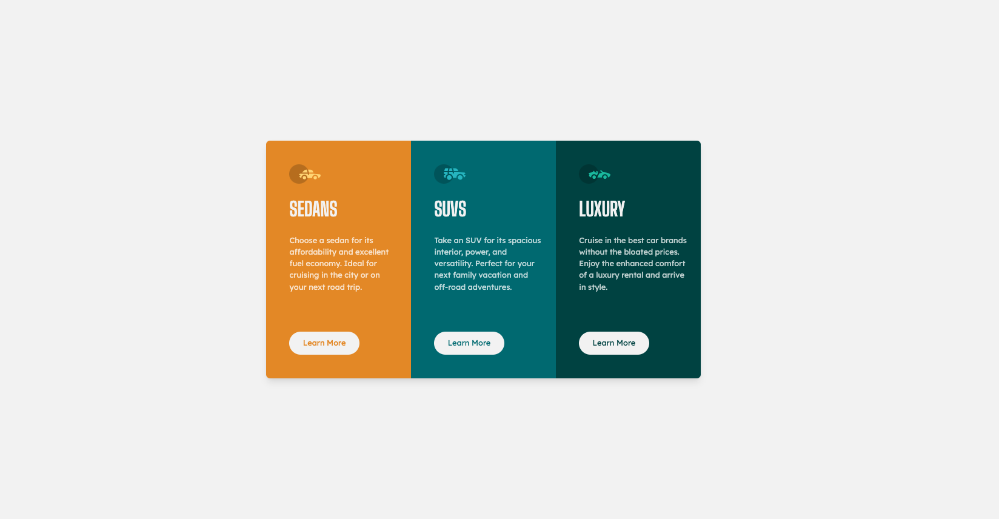

# Frontend Mentor - 3-column preview card component

This is a solution to the [3-column preview card component challenge on Frontend Mentor](https://www.frontendmentor.io/challenges/3column-preview-card-component-pH92eAR2-). 

## The challenge
Users should be able to: 

- View the optimal layout depending on their device's screen size
- See hover states for interactive elements

## Screenshot

## Links
- Solution URL: (https://your-solution-url.com)
- Live Site URL: (https://your-live-site-url.com)

## Author 
- Website - [BKFOE]()
- Frontend Mentor - [@BKFOE]()